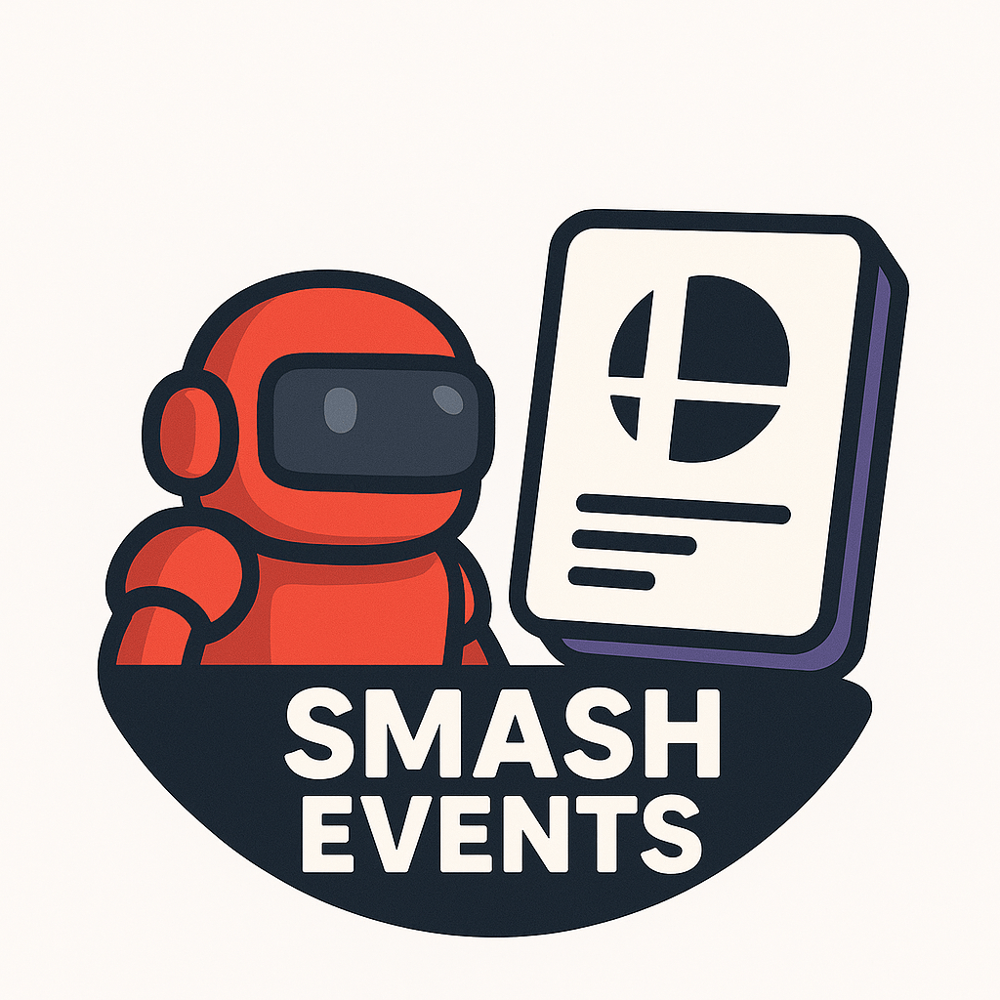

# start.gg Event Adder Discord Bot

This Discord bot automatically fetches real tournament data from the [start.gg](https://start.gg/) API and creates scheduled events in your Discord servers. It supports periodic updates, manual triggers, clearing all events, and test/API-only modes.

## Installing the Hosted Bot

If you want to use the official hosted version of this bot, simply invite it to your server using the following link:

**[Invite the bot](https://discord.com/oauth2/authorize?client_id=1424805620841844829)**

This will add the bot to your server with the required permissions. Once added, it will automatically begin creating tournament events for Germany by default.

### Default Values and Behavior

By default, the bot reads configuration from your `.env` file:

**Default configuration:**

- Country: Germany (`COUNTRY_CODE=DE`)
- Game: Super Smash Bros. Melee (`VIDEOGAME_IDS=1`)

**To customize for production:** Edit your `.env` file to change these defaults. The bot will automatically use your settings for all scheduled runs.

## Features

- 🕒 **Periodic Event Creation**: Automatically fetches and creates events for real tournaments from start.gg, twice daily (8 AM & 8 PM)
- 📅 **Real Tournament Events**: Creates Discord server events with actual tournament details (name, games, venue, streams, etc.)
- 🚀 **Simple Setup**: Just add your Discord and start.gg API tokens
- 🔄 **Continuous Operation**: Runs indefinitely with scheduled tasks
- 🧹 **Clear Events**: Command-line option to delete all scheduled events in all servers
- 🧪 **Test/API-only Modes**: Preview event creation or test API responses without running the bot

## Project Structure

```
├── app.js          # Main bot application
├── .env.sample     # Sample environment file
├── package.json    # Dependencies and scripts
├── README.md       # This file
└── .gitignore      # Git ignore file
```


## Setup and Installation

### Prerequisites

- [Node.js](https://nodejs.org/en/download/) (version 18 or higher)
- A Discord application and bot token
- A start.gg API token ([get one here](https://developer.start.gg/))


### 1. Create a Discord Application

1. Go to the [Discord Developer Portal](https://discord.com/developers/applications)
2. Click "New Application" and give it a name
3. Go to the "Bot" tab and click "Add Bot"
4. Copy the bot token (you'll need this for the `.env` file)
5. Enable "Guilds" and "Guild Scheduled Events" intents


### 2. Bot Permissions

Your bot needs the following permissions:
- `Manage Events` - To create scheduled events
- `View Channels` - Basic bot functionality

When adding the bot to a server, make sure to include these permissions in the invite URL.


### 3. Install Dependencies

```bash
npm install
```


### 4. Configure Environment

1. Copy `.env.sample` to `.env`:
   ```bash
   cp .env.sample .env
   ```

2. Edit `.env` and add your Discord bot token and start.gg API token:
   ```env
   DISCORD_TOKEN=your_actual_bot_token_here
   START_GG_TOKEN=your_startgg_api_token_here
   COUNTRY_CODE=DE
   VIDEOGAME_IDS=1
   ```


### 5. Run the Bot

```bash
npm start
```

For development with auto-restart:
```bash
npm run dev
```


## How It Works

The bot automatically manages tournament events for your Discord servers:

**Scheduled Operation:**
- Runs twice daily (8 AM & 8 PM) using your `.env` configuration
- Fetches tournament data from start.gg API for your specified country and games
- Creates Discord events for upcoming tournaments (skips past events)
- Avoids creating duplicate events by checking existing event names

**Event Details:**
- **Name**: Tournament name (e.g., "Berlin Fighting Game Championship 2024")
- **Description**: Games, venue, stream links, and event page URL
- **Start/End Time**: Actual tournament start and end times
- **Location**: Venue address or city location
- **URL**: Direct link to the start.gg tournament page

**Manual Control:**
- Use `npm run manual` to trigger event creation immediately
- Use `npm run clear` to delete all scheduled events
- Use testing commands to preview events without affecting your servers


## Usage & Command-Line Options

**Production Usage:**

- `npm start` — normal operation (creates events twice daily using your `.env` configuration)
- `npm run manual` — manually trigger event creation once using your `.env` configuration
- `npm run clear` — delete all scheduled events in all servers

**Testing & Development:**

- `npm run test` — test mode: fetches tournaments and previews event creation (no Discord login)
- `npm run test-api` — API-only mode: fetches and previews events from start.gg only
- `npm run test-data` — run separate API testing script for detailed analysis

**Testing with different configurations:**

- `npm run test -- --country=US --games=1,1386` — test with US tournaments for Melee+Ultimate
- `npm run test-api -- --country=JP --games=43868` — test API-only with Japanese SF6 tournaments


### Configuration

**Production Configuration (via Environment Variables):**

The bot reads its configuration from your `.env` file for all scheduled runs:

```env
# Country to fetch tournaments from
COUNTRY_CODE=DE

# Games to include (comma-separated IDs)
VIDEOGAME_IDS=1,1386
```

**Common country codes:** US, DE, JP, FR, GB, CA, AU, etc.

**Testing Configuration (via Command-Line Arguments):**

When testing, you can override the environment settings:

- `npm run test -- --country=US` — Test with US tournaments
- `npm run test -- --games=1386,43868` — Test with Ultimate and SF6
- `npm run test -- --country=JP --games=1` — Test with Japanese Melee tournaments

**How to Find Videogame IDs:**
- Visit [start.gg API docs](https://developer.start.gg/docs/api/videogame-ids) or inspect tournament data for the correct IDs.


## Troubleshooting

**Common Issues:**

1. **Bot not creating events**: Make sure the bot has "Manage Events" permission in the server
2. **Authentication failed**: Check that your `DISCORD_TOKEN` and `START_GG_TOKEN` are correct
3. **No servers found**: The bot needs to be invited to at least one server

**Logs:**

The bot provides helpful console output:
- ✅ Successful operations
- ❌ Errors with details
- ⚠️ Warnings
- 🔄 Status updates
- ⏰ Scheduling information


## License

MIT License - feel free to modify and use as needed.


## Other resources
- Read **[the documentation](https://discord.com/developers/docs/intro)** for in-depth information about Discord API features.
- Join the **[Discord Developers server](https://discord.gg/discord-developers)** to ask questions about the API, attend events hosted by the Discord API team, and interact with other devs.
- Check out **[community resources](https://discord.com/developers/docs/topics/community-resources#community-resources)** for language-specific tools maintained by community members.

Invite your bot with the correct permissions using the Discord OAuth2 URL (replace with your bot's client ID):
```
https://discord.com/oauth2/authorize?client_id=YOUR_CLIENT_ID&scope=bot+applications.commands&permissions=536870912
```